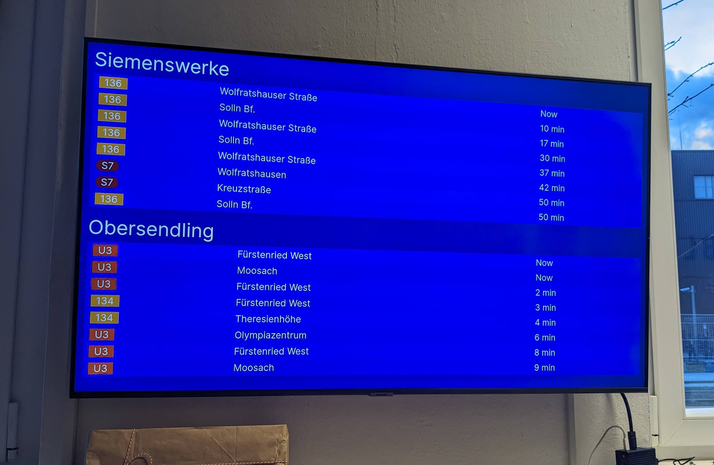
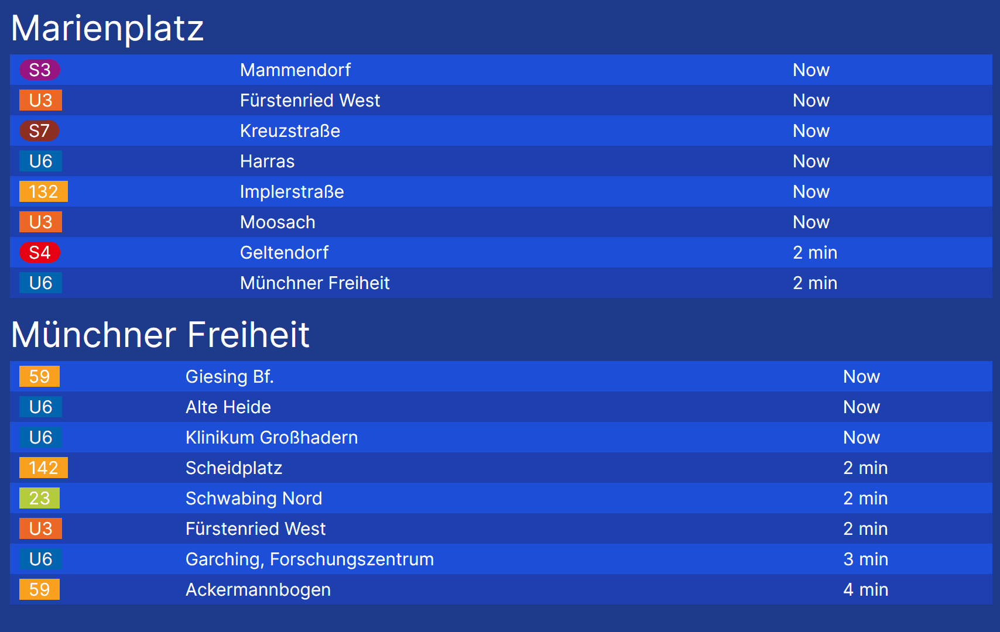

# MVG Departures Infoscreen

[](https://choosealicense.com/licenses/mit/)

This is a simple web app displaying the live departures of the MVG (Münchner Verkehrsgesellschaft) in Munich (Germany) for one or more stations, meant for digital signage.

Currently, running on the infoscreen in the office of [STABL Energy GmbH](https://stabl.com/) powered by [piSignage](https://pisignage.com/):


It is built with [Next.js](https://nextjs.org/), [Tailwind CSS](https://tailwindcss.com/) and [shadcn/ui](https://shadcn.com/).

This project is heavily inspired by [MVGFahrinfo](https://github.com/FaisalBinAhmed/MVGFahrinfo) which has quite similar functionality but runs inside of a terminal and is written in Rust.

## How to use

You can use the webapp deployed to [Vercel](https://vercel.com/dashboard) at [mvg-infoscreen.vercel.app](https://mvg-infoscreen.vercel.app/).

The root page will show you a user interface to configure the stations you want to display. It generates a URL for you by looking up the IDs of the selected stations.

You can also use the `?stations=` query parameter to configure the stations directly in the URL. The value of the query parameter should be a comma-separated list of station IDs. You can find the station IDs by searching for the station on [mvg.de](https://www.mvg.de/fahrinfo/).

For example, to display the departures for the stations "Marienplatz" (ID `de:09162:2`) and "Münchner Freiheit" (ID `de:09162:500`), you can use the following URL: [mvg-infoscreen.vercel.app/infoscreen?stations=de:09162:2,de:09162:500](https://mvg-infoscreen.vercel.app/infoscreen?stations=de:09162:2,de:09162:500), which will display as follows:



## Development

The easiest way to get started is by launching this repository inside a [dev container](https://containers.dev/).

Install the dependencies:

```bash
bun install
```

Then, run the development server:

```bash
bun dev
```

Open [http://localhost:3000](http://localhost:3000) with your browser to see the result.
